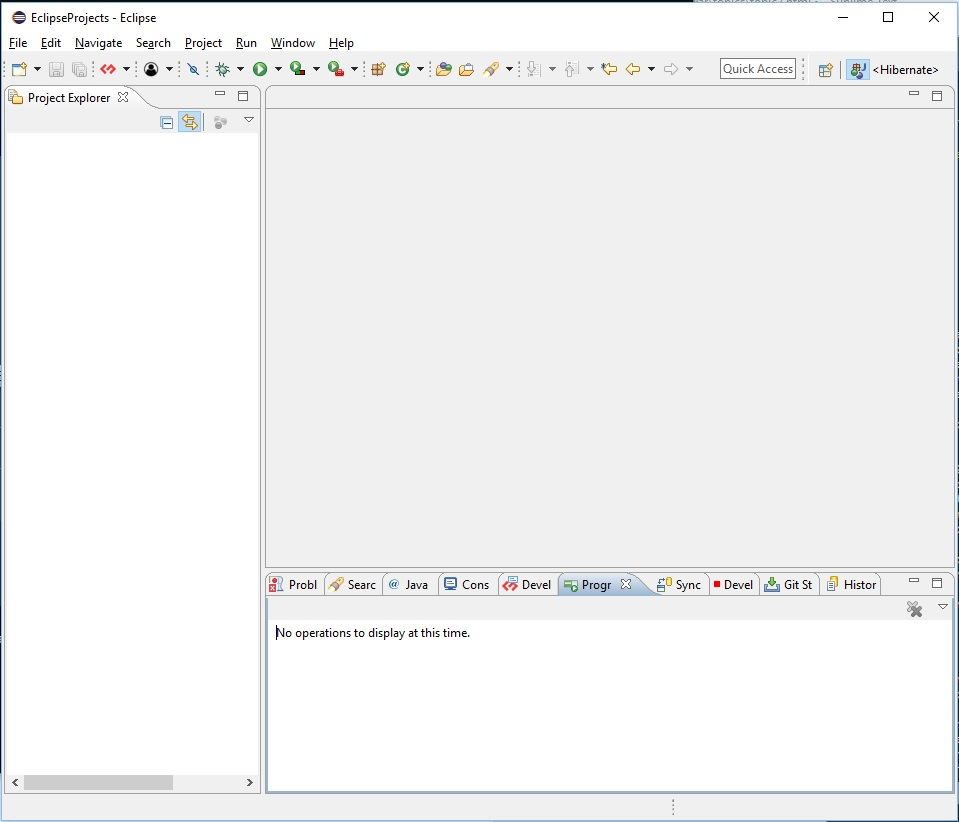
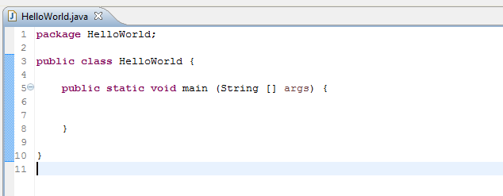
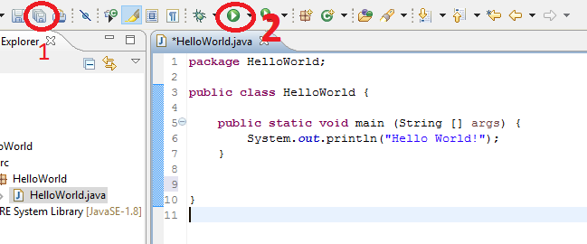
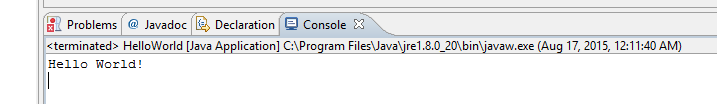

#1.02 Hello World, again

##1.2.1 Creating a project in Eclipse
So now you have JDK and Eclipse in your computer, let's familiar ourselves with them! Launch Eclipse, select the workspace location (this is where your code will be stored), and you will be greeted by this window.



To create your first program, do the following :

1. Click File > New > **Java Project**
2. Type **HelloWorld** in project name, click Finish
3. You should see HelloWorld project appears in the Project Explorer List
4. Expand it, then right click src folder
5. Click New... > **Package**
6. Put **HelloWorld** in the Name field>
7. Click Finish, you should see a HelloWorld in src folder
8. Right click the HelloWorld in the src folder, click New... > **Class**
9. Fill in HelloWorld for in the Name field, Click Finish
10. Eclipse should open HelloWorld.java for you



##1.2.2 The classic Hello World
In our project, the "main" method is the first entry point for the entire program to run. When it is executed, the first line of code to run is in main method. 

To make our first program, paste this line of code into middle of main method:
```Java
System.out.println("Hello World!");
```

Then click save and run button : 



You will now see the console shows :



Let’s try to do something more interesting. Change the Hello World! into your name and see what happens in the console! Beware :

* You need the sign "" because you are creating a **string**.
* A string is a series of characters, “Java is Fun”, “I’m learning programming” are the examples of String.


Try to print more things in the console by using multiple lines of
```Java
System.out.println("Anything to print");
```
Perhaps, like this?
```Java
public static void main (String [] args) {
	System.out.println("My name is kingkingyyk");
	System.out.println("My address is abc, 123, def");
	System.out.println("I'm 99 years old");
}
```
It is important that you put an indent to show your code's parent. In this case, we indent the System.out.println() below our main method as it is under main method!


##1.2.3 Comment
If you want to mask some code temporarily, Java has // for you to indicate that you don't want the line to be included in the program. Example :
```Java
public static void main (String [] args) {
	System.out.println("I will be printed!");
//	System.out.println("I won't be printed");
}
```

If you want to comment multiple lines, you can use /* to indicate the starting point, and */ for the closing point.
```Java
public static void main (String [] args) {
	System.out.println("I will be printed!");
/*	System.out.println("I won't be printed");
	System.out.println("Me too!"); */
}
```
It is originally intended for the programmer to leave comment on the line of code for further reference.

##Learning Checkpoint
* The main function is the first function to execute when a Java program starts
* System.out.println() is the function to display the messages in the console
* “ ” signs are required for String
* Every left bracket used must have a right bracket
* On the very end in a line of code, you need to put ; as indication