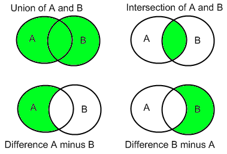

#5.2 Set
Set is a group of **unique** elements. (ArrayList allows duplicated elements)

##5.2.1 Set Operations


##5.2.2 Implementation
```Java
public class Set<T> {
	private T [] obj;
	private int count=0;

	public Set (int size) {
		this.obj=(T[]) new Object[size];
	}
	
	public void add (T t) {
		this.obj[this.count++]=t;
	}
	
	public void remove (T t) {
		for (int i=0;i<this.count;i++) {
			if (this.obj[i].equals(t)) {
				this.obj[i]=this.obj[this.count-1];
				this.count--;
			}
		}
	}
	
	public Set<T> intersect (Set<T> s) {
		T [] tempObj=(T[]) new Object[Math.min(this.count,s.count)];
		int tempObjCount=0;
		for (int i=0;i<this.count;i++) {
			for (int i2=0;i2<s.count;i2++) {
				if (this.obj[i].equals(s.obj[i2])) {
					tempObj[tempObjCount++]=this.obj[i];
					break;
				}
			}
		}
		Set<T> intSet=new Set<>(tempObjCount);
		for (int i=0;i<tempObjCount;i++) {
			intSet.add(tempObj[i]);
		}
		return intSet;
	}
	
	public Set<T> difference (Set<T> s) {
		T [] tempObj=(T[]) new Object[Math.max(this.count,s.count)];
		int tempObjCount=0;
		for (int i=0;i<this.count;i++) {
			boolean exists=false;
			for (int i2=0;i2<s.count && !exists;i2++) {
				if (this.obj[i].equals(s.obj[i2])) {
					exists=true;
				}
			}
			if (!exists) {
				tempObj[tempObjCount++]=this.obj[i];
			}
		}
		Set<T> diffSet=new Set<>(tempObjCount);
		for (int i=0;i<tempObjCount;i++) {
			diffSet.add(tempObj[i]);
		}
		return diffSet;
	}
	
	public Set<T> union (Set<T> s) {
		Set<T> unionSet=new Set<>(this.obj.length+s.obj.length);
		for (int i=0;i<this.count;i++) {
			unionSet.add(this.obj[i]);
		}
		for (int i=0;i<s.count;i++) {
			unionSet.add(s.obj[i]);
		}
		return unionSet;
	}
	
	public int size () {
		return this.count;
	}
	
	public T[] toArray() {
		T [] ary=(T [])new Object[this.count];
		System.arraycopy(this.obj, 0, ary, 0, this.count);
		return ary;
	}
}
```

!!! WARNING
	Can you point out what is the problem with the code above? Hint : `add`

Now, here is a challenge for you. Can you implement it using the Java built-in ArrayList?

Lastly, Java does provide Set classes out of the box, namely `TreeSet` & `HashSet`.