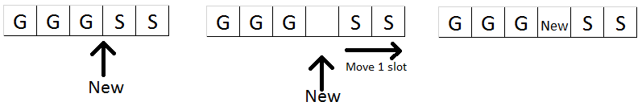

#5.3 Linked List

A list is a sequence of elements in certain order. If we remove one element in the list, the sequence of other elements are not affected.

We have two types of linked list, namely `Singly Linked List` & `Doubly Linked List`.

For convenience purpose, we have an Object called as `Node` to carry the element as well as the pointer to point to previous and next `Node`. (only previous or next in Singly Linked List)

By knowing only a node, we can traverse to another node using the previous or next relation and eventually whole sequence (chain).

##5.3.1 Real World Problem
Solve this please!

*TGI Fridays decided to offer different privileges for customer, namely Gold, Silver & Bronze. A customer will gold privilege will get the food first served earlier than customer with Silver privilege (even the Silver customer comes in earlier), so do Silver to Bronze. The chef will get the order to cook from the list and remove the order from the list once the preparation starts. They hired you to modify their existing program to do this because it was a mess for the waiters! Here is a mock of current system (where it will generate the orders randomly and list out the current order list for you!), modify the manageOrder function!*

```Java
public static String [] FOODS={"Fried Mac & Cheese","Boneless Buffalo Bites",
				      "Loaded Chip Nacho", "Seafood Platter",
				      "Buffalo Wings","Caesar Salad",
				      "Clam Chowder","Tennessee Steak"};
	public static String [] GRADES={"GOLD","SILVER","BRONZE"};
	public static ArrayList<Order> Orders=new ArrayList<>();
	
	public static class Order {
		String food;
		String grade;
		Date OrderTime;
	}
	
	public static void manageOrder(Order newOrder) {
		//Modify your code here! Include the below .add!
		Orders.add(newOrder);
	}
	
	public static void displayOrders () {
		for(int clear = 0; clear < 100; clear++) {
		    System.out.println() ;
		}
		Iterator<Order> it=Orders.iterator();
		SimpleDateFormat formatter=new SimpleDateFormat("MM/dd/yyyy HH:mm:ss");
		System.out.println("=== Order List @"+formatter.format(new Date())+"===");
		while (it.hasNext()) {
			Order o=it.next();
			System.out.println(formatter.format(o.OrderTime)+"\t"+o.grade+"\t"+o.food);
		}
	}

	public static void main (String [] abc) {
		Random rdn=new Random();
		for (int i=0;i<10;i++) {
			Order o=new Order();
			o.food=FOODS[rdn.nextInt(FOODS.length)];
			o.grade=GRADES[rdn.nextInt(GRADES.length)];
			o.OrderTime=new Date();
			manageOrder(o);
			displayOrders();
			try {
				Thread.sleep(rdn.nextInt(2500)+500);
			} catch (InterruptedException e) {}
		}
}
```

* Way 1 – Sort the array list when we add new order inside! 
* Way 2 – Search for the list until we found the last order with the same privilege, then add the new order behind it. This is done via moving the orders after the last order with lower privilege behind by 1, then we can fit the order into the slot.


... But both are inefficient!
* Way 1 - You need to deal with massive amount of sorting operations
* Way 2 – Extremely slow when the elements you want to move are a lot.

##5.3.2 Tackling the Inefficiency
Here is where LinkedList comes into useful! The operation is similar to way 2, but you don’t have to move the elements back!

Linked list consists of many linked structures, namely node.


A node contains the relation with another node. We can traverse through whole list by exploiting the relation. * The relation is either previous or next, or even both (as shown in the image above)
* A node also carry element (the data you want to store)
* The first node in the list is called as head node, the last node in the list is called as tail node.

Complexity comparison to array :

LinkedList|Type|Array
-|-|-
\(O(1)\)|Insertion|\(O(n)\)
\(O(n)\)|Linear Search|\(O(n)\)
\(O(1)\)|Deletion + Merging|\(O(n)\)
\(O(n)\)|Access By Index|\(O(1)\)

The deal breaker to decide whether to use array or linked list are above.

##5.3.3 Addition / Removal of Element(Node)
Adding a new element contains several cases

* Add to the first position
    * The list is empty
    * The list is not empty
* Adding to last position
    * The list is empty (perform the same with adding to first position + empty list)
    * The list is not empty
* Adding to n position
    * N = 0, refer to add to first position
    * N = List Size, refer to add to last position
    * 0 < N < List Size

Removing an element also contains several cases

* The element is at the first position
* The element is at the last position
* The element is at the middle

## 5.3.4 Implementation
First, we have to define the classes first – The list itself and the node.
```Java
public class LinkedList<E> {
	private Node<E> head;
	private int size;
	//private to prevent buggers from tempering the values. :P
}
	
public class Node<E> {
	public Node<E> prev;
	public Node<E> next;
	public E element;
		
	public Node (E e) {
		this.element=e;
	}
}
```

Add first, add last, remove first and remove last are the easiest methods to implement, so we shall start with them first.